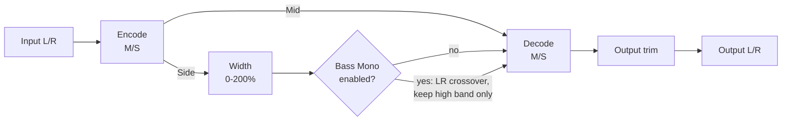

# Architecture

## Signal flow

`FirmamentEngine` (`src/dsp/FirmamentEngine.{h,cpp}`) owns the whole chain. `MidSideCodec` (`src/dsp/MidSideCodec.h`) is a small, stateless pair of encode/decode functions factored out so the core Mid/Side identity is directly unit-testable without any DSP state involved (`tests/MidSideCodecTests.cpp`).

## Module map

| Directory | Responsibility |
|---|---|
| `src/dsp` | All audio-thread DSP: `MidSideCodec` (stateless M = (L+R)/2, S = (L-R)/2 encode/decode) and `FirmamentEngine` (the full chain: Width scale, optional bass-mono crossover, output trim). No allocation, locks, or I/O once `prepare()` has run. Independent of `juce::AudioProcessor` so it is directly unit-testable (see `tests/EngineTests.cpp`, `tests/MidSideCodecTests.cpp`, `tests/GainStagingTests.cpp`). |
| `src/params` | Parameter layout and `AudioProcessorValueTreeState` definitions - parameter IDs, ranges, defaults. Single source of truth for what a preset captures. |
| `src/PluginProcessor.*` | Host plumbing: APVTS construction, bus-layout negotiation (stereo out, mono-or-stereo in), `prepareToPlay`/`processBlock`/`reset`, latency reporting (always 0), state save/load. Reads APVTS values and pushes them into `FirmamentEngine` every block; does not implement any DSP itself. |
| `src/PluginEditor.*` | A simple, functional v0.1 GUI: one rotary slider per parameter (Width, Bass Mono, Output) bound via `SliderAttachment`. A custom vector-drawn GUI is a later milestone. |

Dependency direction is one-way: `PluginEditor` -> `params` (via attachments) and `PluginProcessor` -> `params` + `dsp`. `src/dsp` has no upward dependency on the processor or UI, which is what keeps `FirmamentEngine` testable in isolation.

## Mid/Side width and the mono-compatibility invariant

`MidSideCodec::encode` computes `mid = (left + right) * 0.5` and `side = (left - right) * 0.5`; `decode` computes `left = mid + side`, `right = mid - side`. `FirmamentEngine::process()` scales only the Side channel by the Width parameter (0-200%, unity at 100%) before decoding back to L/R - Mid is never touched by Width.

This has a useful, load-bearing consequence: since decode is always `left + right == 2 * mid` **regardless of what Side is**, the mono downmix of Firmament's output is exactly identical to the mono downmix of its input at *any* Width setting, including 0% (fully collapsed to mono) and 200% (maximally wide). Widening the stereo image can never change what a listener folding down to mono hears - `tests/EngineTests.cpp`'s "Mono downmix is unaffected by Width or bass-mono" test verifies this invariant end-to-end across a spread of settings, and `tests/MidSideCodecTests.cpp` verifies it at the stateless codec level directly.

At Width = 100% with the bass-mono stage off, scaling Side by exactly 1.0 makes the whole chain an identity transform, so the plugin nulls against its input - this is `tests/EngineTests.cpp`'s "unity M/S round-trip" test, to < -90 dBFS residual (matched to the specified tolerance rather than the tighter bound plain floating-point round-trip arithmetic would actually achieve, so the test stays meaningful if the tolerance is later relaxed for a different reason).

## Bass-mono crossover

The optional bass-mono stage forces the Side channel to (near) zero below `BassMonoFreq` (0-500 Hz, 0 = fully off), which - because Mid is unaffected - collapses the *low end only* of the stereo image to mono on decode, a standard mastering/mixing technique for keeping sub-bass energy centered while the width control still affects the rest of the spectrum.

It is implemented with a single `juce::dsp::LinkwitzRileyFilter<float>` (JUCE 8.0.14, `juce_dsp/processors/juce_LinkwitzRileyFilter.h`), prepared with `numChannels = 1` since it operates on just the one derived Side stream rather than the stereo bus. Its dual-output `processSample(channel, input, outputLow, outputHigh)` overload returns matched low-pass and high-pass bands whose sum reconstructs the input exactly (flat-magnitude sum, LR4/-24 dB per octave); `FirmamentEngine` keeps only the high-passed band and discards the low band, which is exactly "Side is zero below the crossover frequency."

This filter uses a TPT (topology-preserving transform) structure and, unlike an FIR crossover or an oversampled nonlinearity, **introduces no reported or oversampling-style latency at all** - it is a direct-form IIR filter, sample-synchronous by construction. `FirmamentEngine::getLatencySamples()` is therefore a `static constexpr` `0`, and `tests/LatencyTests.cpp` asserts this holds across sample rates, block sizes, and bass-mono on/off.

0 Hz is a frozen "off" sentinel (see `ParameterIds.h`): `setBassMonoFrequencyHz(0.0f)` is never forwarded to the crossover's frequency smoother or `setCutoffFrequency()` (which requires a strictly positive, sub-Nyquist cutoff - JUCE 8.0.14 asserts `isPositiveAndBelow(cutoff, sampleRate * 0.5)`); instead `process()` gates the entire crossover stage on `lastBassMonoHz > 0.0f` and passes the Width-scaled Side channel straight through when it is 0.

## Mono input handling

Firmament fundamentally needs two channels to do anything meaningful (Mid/Side encoding is undefined for a single channel), but `isBusesLayoutSupported()` still accepts a mono *input* bus paired with the (always-required) stereo output bus, since some hosts route a mono source into a stereo effect chain. `PluginProcessor::processBlock()` duplicates the single input channel into the second channel before handing the buffer to the engine - this makes the encoded Side channel exactly 0 (rather than clearing it, which would instead make Side equal to half the mono signal, an unintended hard-panned artifact), so a mono source degrades gracefully to an unwidened mono pass-through regardless of the Width setting (`tests/RobustnessTests.cpp`'s mono-input-bus test).

## Real-time safety

- `FirmamentAudioProcessor::processBlock()` starts with `juce::ScopedNoDenormals`.
- All DSP state (the crossover's filter state, the output gain ramp) is allocated in `prepare()`/`prepareToPlay()` and never reallocated on the audio thread.
- `reset()` clears crossover/gain state without deallocating (`FirmamentEngine::reset()`, called from both `AudioProcessor::reset()` and internally from `prepare()`).
- Parameter values are read via `apvts.getRawParameterValue()` atomics in `processBlock()`, never via `apvts.getParameter()->getValue()` and never via `String`-keyed lookups on the audio thread.
- `FirmamentEngine::process()` treats a zero-sample or non-stereo block as a safe no-op before touching any filter/gain state.
- Every input sample is scrubbed for NaN/Inf (replaced with 0.0f) before it reaches the Mid/Side encode or the crossover: unlike a purely feedforward gain stage, the crossover's IIR state carries a poisoned value forward indefinitely once it gets in, so a single corrupted host sample would otherwise permanently contaminate every subsequent block rather than being contained to the one bad block (`tests/RobustnessTests.cpp`'s NaN/Inf sweep test).
- The bass-mono crossover frequency is clamped strictly positive and below Nyquist (`clampBelowNyquist`, in `FirmamentEngine.cpp`) before being passed to `setCutoffFrequency()`, as defensive insurance against invalid coefficients if the plugin is ever prepared at an unusually low sample rate.

## Parameter smoothing

- **Width** is a plain multiplicative scale on the Side channel with no coefficients to recompute, so it is smoothed linearly and interpolated per-sample via `SmoothedValue::getNextValue()`.
- **Bass Mono Freq** recomputes `LinkwitzRileyFilter` coefficients (a `tan()` call) on change, so - like Overture's Tight/Tone filters - it is smoothed multiplicatively (appropriate for a quantity perceived logarithmically) but re-derived once per block via `skip()` rather than per sample.
- **Output** is a plain gain stage (`juce::dsp::Gain<float>`), which ramps sample-accurately via its own internal `SmoothedValue` (`setRampDurationSeconds`).
- All smoothers are seeded to their real starting value in `FirmamentEngine::prepare()`, so re-preparing (sample-rate change, etc.) never resets a live parameter back to a built-in default or lets the frequency smoother start from an invalid 0 Hz.
