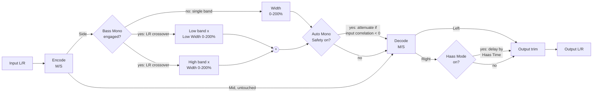

# Architecture

## Signal flow

`FirmamentEngine` (`src/dsp/FirmamentEngine.{h,cpp}`) owns the whole chain. `MidSideCodec` (`src/dsp/MidSideCodec.h`) is a small, stateless pair of encode/decode functions factored out so the core Mid/Side identity is directly unit-testable without any DSP state involved (`tests/MidSideCodecTests.cpp`).

## Module map

| Directory | Responsibility |
|---|---|
| `src/dsp` | All audio-thread DSP: `MidSideCodec` (stateless M = (L+R)/2, S = (L-R)/2 encode/decode) and `FirmamentEngine` (the full chain: multiband Width/Low Width, Auto Mono Safety, output trim, Haas Mode). No allocation, locks, or I/O once `prepare()` has run. Independent of `juce::AudioProcessor` so it is directly unit-testable (see `tests/EngineTests.cpp`, `tests/MidSideCodecTests.cpp`, `tests/GainStagingTests.cpp`, `tests/MultibandWidthTests.cpp`, `tests/AutoMonoSafetyTests.cpp`, `tests/CorrelationMeterTests.cpp`, `tests/HaasModeTests.cpp`). |
| `src/params` | Parameter layout and `AudioProcessorValueTreeState` definitions - parameter IDs, ranges, defaults. Single source of truth for what a preset captures. |
| `src/PluginProcessor.*` | Host plumbing: APVTS construction, bus-layout negotiation (stereo out, mono-or-stereo in), `prepareToPlay`/`processBlock`/`reset`, latency reporting (always 0), state save/load, and refreshing the correlation/phase meter atomic from the engine every block. Reads APVTS values and pushes them into `FirmamentEngine` every block; does not implement any DSP itself. |
| `src/PluginEditor.*` | A simple, functional v0.1-style GUI: one rotary slider per float parameter and one toggle button per bool parameter, bound via `SliderAttachment`/`ButtonAttachment`. A custom vector-drawn GUI and an actual correlation/phase meter *widget* (the underlying value is already computed - see below) are M3 scope. |

Dependency direction is one-way: `PluginEditor` -> `params` (via attachments) and `PluginProcessor` -> `params` + `dsp`. `src/dsp` has no upward dependency on the processor or UI, which is what keeps `FirmamentEngine` testable in isolation.

## Mid/Side width and the mono-compatibility invariant

`MidSideCodec::encode` computes `mid = (left + right) * 0.5` and `side = (left - right) * 0.5`; `decode` computes `left = mid + side`, `right = mid - side`. `FirmamentEngine::process()` only ever scales the *Side* channel - via Width, multiband Low Width/Width, and Auto Mono Safety, all described below - before decoding back to L/R; Mid is never touched by any of them.

This has a useful, load-bearing consequence: since decode is always `left + right == 2 * mid` **regardless of what Side is**, the mono downmix of Firmament's output is exactly identical to the mono downmix of its input at *any* Width/Low Width/Auto Mono Safety setting, including 0% (fully collapsed to mono) and 200% (maximally wide). Widening the stereo image can never change what a listener folding down to mono hears - `tests/EngineTests.cpp`'s "Mono downmix is unaffected by Width or bass-mono" test and `tests/MultibandWidthTests.cpp`'s/`tests/AutoMonoSafetyTests.cpp`'s equivalents verify this invariant end-to-end across a spread of settings, and `tests/MidSideCodecTests.cpp` verifies it at the stateless codec level directly.

**This invariant does not extend to Haas Mode** (see below) - Haas Mode operates after M/S decode and intentionally offsets Right in time relative to Left, which is incompatible with an exact `left + right == 2 * mid` guarantee by construction. It is off by default and clearly documented as a different, non-M/S widening technique.

At Width = 100% with the bass-mono stage off, scaling Side by exactly 1.0 makes the whole chain an identity transform, so the plugin nulls against its input - this is `tests/EngineTests.cpp`'s "unity M/S round-trip" test, to < -90 dBFS residual (matched to the specified tolerance rather than the tighter bound plain floating-point round-trip arithmetic would actually achieve, so the test stays meaningful if the tolerance is later relaxed for a different reason). `tests/SampleRateSweepTests.cpp` extends this same null test across the full 44.1-192 kHz range.

## Multiband width (Low Width / Width)

When the bass-mono crossover is engaged (`BassMonoFreq` > 0), the Side signal is split into a low and a high band by the crossover (see below), and each band is scaled by its own independent width control before being summed back together: `Low Width` (0-200%, default 0%) below the crossover frequency, `Width` (0-200%, default 100%) above it. With the crossover off, `Width` alone scales the whole (single-band) Side signal, exactly as in v0.1.

`Low Width`'s default of 0% exactly reproduces v0.1's original "bass mono forces the low band to silence" behaviour: scaling a filtered band by a constant commutes exactly with scaling-then-filtering (both linear operations), so discarding the low band entirely (v0.1) and multiplying it by 0 after extracting it (M1) are equivalent. This is a strict generalisation of the v0.1 feature, not a behaviour change, at the default setting - `tests/MultibandWidthTests.cpp`'s "Low Width 0% ... reproduces the v0.1 ... behaviour" test verifies this directly, and the original v0.1 bass-mono test (`tests/EngineTests.cpp`) continues to pass unmodified against the new engine.

At any other `Low Width`, or when both bands are re-summed with a nonzero gain (including `Low Width == Width == 100%`), the recombined Side is **not** a null/identity operation relative to the un-split signal - see "Bass-mono crossover" below for why, and `tests/MultibandWidthTests.cpp`'s "preserves signal magnitude (flat-magnitude allpass sum, not an exact null)" test for the documented, verified behaviour. This is standard, expected behaviour for any Linkwitz-Riley-crossover-based multiband processor, not a defect.

## Auto Mono Safety

A running, leaky-integrated (200 ms one-pole) correlation estimate of the plugin's *input* L/R - computed every sample from `sum(L*R) / sqrt(sum(L*L) * sum(R*R))`, independent of whether the feature is engaged, so it is always current for `FirmamentEngine::getCorrelationValue()` (see "Correlation/phase meter" below) - drives an optional additional attenuation of the Side signal: full Side gain while the input is in-phase or uncorrelated (correlation >= 0), ramping linearly down toward a 0.35 floor gain as correlation approaches -1 (fully out-of-phase). Off by default.

Because this only ever scales Side and never touches Mid, it can never break the `left + right == 2 * mid` mono-sum invariant above, regardless of how aggressively it reacts - `tests/AutoMonoSafetyTests.cpp`'s "never breaks the mono-sum invariant" test verifies this directly with a strongly anti-phase input.

Deriving the estimate from the plugin's raw input (rather than its Width-scaled output) keeps it a direct read of the source material's own mono-compatibility risk and avoids a feedback loop with the very Side scaling it drives.

## Correlation/phase meter

`FirmamentEngine::getCorrelationValue()` exposes the same running correlation estimate that drives Auto Mono Safety (see above), in `[-1, 1]` (`1` = perfectly in-phase, `0` = uncorrelated, `-1` = perfectly out-of-phase), updated once per `process()` call. `FirmamentAudioProcessor::getCorrelationMeterValue()` refreshes an atomic from it at the end of every `processBlock()`, safe to read from any thread. `tests/CorrelationMeterTests.cpp` verifies the estimate converges toward +1/-1 for in-phase/anti-phase signals, stays finite for silence, and stays within `[-1, 1]` across a randomised sweep.

This is DSP-complete but **not yet wired to a GUI meter widget** - the v0.1-style editor (`src/PluginEditor.*`) does not display it. Building an actual meter component is explicitly M3 scope (GitHub issue "Custom GUI / LookAndFeel": *"Add metering where relevant to the plugin"*), not M1.

## Haas Mode

An alternative, non-M/S widening technique, applied *after* M/S decode: when engaged, the Right channel is delayed by `Haas Time` (0-40 ms, default 20 ms) relative to Left via a `juce::dsp::DelayLine<float, DelayLineInterpolationTypes::Linear>`, trading the M/S width-scaling model's exact mono-sum guarantee for a stronger, well-known psychoacoustic widening effect (the precedence effect). Off by default, and orthogonal to Width/multiband width/Auto Mono Safety, which all operate purely in the M/S domain before Haas Mode's post-decode delay is applied.

The delay line is always pushed/popped every sample, even while Haas Mode is off (with the delay pinned to 0 samples, which - by construction of the delay line's lockstep read/write pointers - is an exact passthrough), so enabling it mid-stream never starts from stale/discontinuous buffered history. `tests/HaasModeTests.cpp`'s "off (default) is a fully transparent passthrough" test verifies this against the same -90 dBFS bound as the v0.1 unity round-trip test, and its "delays Right by the configured time in samples" test verifies the delay mechanism directly with an impulse.

Haas Mode's delay is an intentional *relative* channel-to-channel offset - the whole point of the effect - not a processing artifact a host needs to compensate for (the same way a chorus/flanger's internal modulated delay is not reported as plugin latency either), so it is never reported via `getLatencySamples()`.

## Bass-mono crossover

The bass-mono stage is implemented with a single `juce::dsp::LinkwitzRileyFilter<float>` (JUCE 8.0.14, `juce_dsp/processors/juce_LinkwitzRileyFilter.h`), prepared with `numChannels = 1` since it operates on just the one derived Side stream rather than the stereo bus, and reused for both the original v0.1 "force to mono below the crossover" behaviour and the M1 multiband-width split (see above) - both are the same underlying dual-output `processSample(channel, input, outputLow, outputHigh)` call.

**On the sum of its two outputs:** per JUCE's own class documentation, *"Linkwitz-Riley filters are widely used in audio crossovers that have two outputs, a low-pass and a high-pass, such that their sum is equivalent to an all-pass filter with a flat magnitude frequency response."* In other words, `outputLow + outputHigh` preserves the input's magnitude but **not** its phase/sample-domain identity - confirmed empirically during development (summing the two unscaled bands reproduces the input's RMS level closely but not its individual sample values). This is why v0.1's original bass-mono feature only ever *discards* the low band and keeps the high band alone rather than re-summing anything: a highpass filter's output is genuinely close to zero below its own cutoff on its own, a property that does not depend on any sum-identity claim. `tests/EngineTests.cpp`'s "Bass-mono forces the Side channel to (near) zero" test verifies exactly that in isolation, and `tests/MultibandWidthTests.cpp`'s "preserves signal magnitude" test verifies the flat-*magnitude* half of the documented guarantee directly when both bands are re-summed for multiband width.

This filter uses a TPT (topology-preserving transform) structure and, unlike an FIR crossover or an oversampled nonlinearity, **introduces no reported or oversampling-style latency at all** - it is a direct-form IIR filter, sample-synchronous by construction. `FirmamentEngine::getLatencySamples()` is therefore a `static constexpr` `0`, and `tests/LatencyTests.cpp` asserts this holds across sample rates, block sizes, and bass-mono on/off.

0 Hz is a frozen "off" sentinel (see `ParameterIds.h`): `setBassMonoFrequencyHz(0.0f)` is never forwarded to the crossover's frequency smoother's *target* (which requires a strictly positive, sub-Nyquist cutoff - JUCE 8.0.14 asserts `isPositiveAndBelow(cutoff, sampleRate * 0.5)`); instead `process()` gates only which *output* is used - the low/high split (multiband) vs. the Width-scaled Side channel straight through (single-band) - on `lastBassMonoHz > 0.0f`. The crossover itself is always run against the live Side signal, even while disabled, the same "always process, conditionally use" pattern the Haas Mode delay line below already follows: `LinkwitzRileyFilter::processSample()`'s internal TPT state (s1-s4) is otherwise only mutated when called, so gating the call itself (rather than just its output) left that state frozen at whatever it held when the section was last engaged - not decayed or reset - producing an audible transient on re-engagement (e.g. `BassMonoFreq` automation sweeping back up through 0 Hz). Fixed for v0.1.1; see `tests/MultibandWidthTests.cpp`'s "re-engaging after a disabled stretch resumes from live filter state" test.

## Mono input handling

Firmament fundamentally needs two channels to do anything meaningful (Mid/Side encoding is undefined for a single channel), but `isBusesLayoutSupported()` still accepts a mono *input* bus paired with the (always-required) stereo output bus, since some hosts route a mono source into a stereo effect chain. `PluginProcessor::processBlock()` duplicates the single input channel into the second channel before handing the buffer to the engine - this makes the encoded Side channel exactly 0 (rather than clearing it, which would instead make Side equal to half the mono signal, an unintended hard-panned artifact), so a mono source degrades gracefully to an unwidened mono pass-through regardless of the Width setting (`tests/RobustnessTests.cpp`'s and `tests/BusConfigTests.cpp`'s mono-input-bus tests). `tests/BusConfigTests.cpp` also directly exercises `isBusesLayoutSupported()`'s accepted and rejected configurations (mono/stereo in, stereo out only, surround and mono-out rejections).

## Real-time safety

- `FirmamentAudioProcessor::processBlock()` starts with `juce::ScopedNoDenormals`.
- All DSP state (the crossover's filter state, the Haas Mode delay line, the output gain ramp) is allocated in `prepare()`/`prepareToPlay()` and never reallocated on the audio thread.
- `reset()` clears crossover/gain/delay-line/correlation state without deallocating (`FirmamentEngine::reset()`, called from both `AudioProcessor::reset()` and internally from `prepare()`).
- Parameter values are read via `apvts.getRawParameterValue()` atomics in `processBlock()`, never via `apvts.getParameter()->getValue()` and never via `String`-keyed lookups on the audio thread; the two new bool parameters (Auto Mono Safety, Haas Mode) are read the same way and thresholded at `> 0.5f`.
- `FirmamentEngine::process()` treats a zero-sample or non-stereo block as a safe no-op before touching any filter/gain/delay state.
- Every input sample is scrubbed for NaN/Inf (replaced with 0.0f) before it reaches the Mid/Side encode, the crossover, or the correlation estimator: unlike a purely feedforward gain stage, the crossover's IIR state (and the correlation estimator's leaky integrators) carry a poisoned value forward indefinitely once it gets in, so a single corrupted host sample would otherwise permanently contaminate every subsequent block rather than being contained to the one bad block (`tests/RobustnessTests.cpp`'s NaN/Inf sweep test).
- The bass-mono crossover frequency is clamped strictly positive and below Nyquist (`clampBelowNyquist`, in `FirmamentEngine.cpp`) before being passed to `setCutoffFrequency()`, as defensive insurance against invalid coefficients if the plugin is ever prepared at an unusually low sample rate. The Haas Mode delay time is likewise clamped to `[0, haasDelayLine.getMaximumDelayInSamples()]` before being passed to `DelayLine::setDelay()`.

## Parameter smoothing

- **Width** and **Low Width** are plain multiplicative scales on their respective Side bands with no coefficients to recompute, so both are smoothed linearly and interpolated per-sample via `SmoothedValue::getNextValue()`.
- **Bass Mono Freq** recomputes `LinkwitzRileyFilter` coefficients (a `tan()` call) on change, so - like Overture's Tight/Tone filters - it is smoothed multiplicatively (appropriate for a quantity perceived logarithmically) but re-derived once per block via `skip()` rather than per sample.
- **Haas Time** is likewise re-derived once per block via `skip()` rather than per sample - there is no audible benefit to sample-accurate updates for a manually-set widening parameter, and `DelayLine::setDelay()` is cheap regardless.
- **Haas Mode** (bool parameter) is read once per block as an instant on/off gate - its delay line is always pushed/popped regardless (pinned to 0 samples while off), so the gate itself introduces no discontinuity; no separate smoothing is needed.
- **Auto Mono Safety** (bool parameter) crossfades between fully bypassed and fully engaged via a dedicated linearly-smoothed 0..1 amount (`autoMonoSafetyAmountSmoothed`, same `smoothingTimeSeconds` as Width/Low Width), rather than being read as an instant per-block gate. The correlation-derived safety gain is always computed (the correlation sums already run unconditionally - see above) and blended between 1.0 (bypass) and that gain by the smoothed amount. This was originally an instant gate like Haas Mode, but because the correlation estimate keeps running while the feature is nominally off, the derived gain can already be sitting at its ~0.35 floor (~-9 dB) the instant the toggle is flipped on - stepping Side gain by up to ~9 dB in a single sample. Fixed for v0.1.1; see `tests/AutoMonoSafetyTests.cpp`'s "toggle ramps the Side gain smoothly instead of stepping" test.
- **Output** is a plain gain stage (`juce::dsp::Gain<float>`), which ramps sample-accurately via its own internal `SmoothedValue` (`setRampDurationSeconds`).
- All smoothers are seeded to their real starting value in `FirmamentEngine::prepare()`, so re-preparing (sample-rate change, etc.) never resets a live parameter back to a built-in default or lets the frequency/delay smoothers start from an invalid value.
